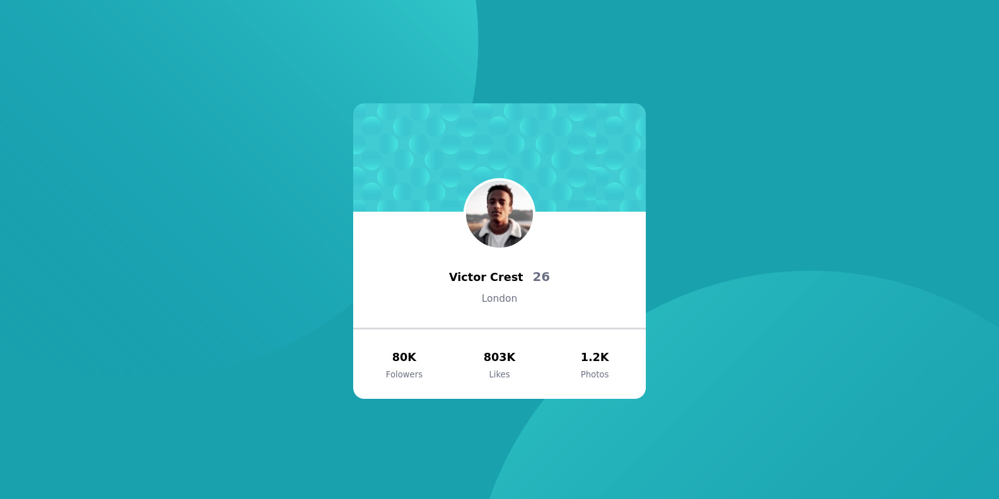

# Frontend Mentor - Profile card component solution

This is a solution to the [Profile card component challenge on Frontend Mentor](https://www.frontendmentor.io/challenges/profile-card-component-cfArpWshJ). Frontend Mentor challenges help you improve your coding skills by building realistic projects.

## Table of contents

- [Overview](#overview)
  - [The challenge](#the-challenge)
  - [Screenshot](#screenshot)
  - [Links](#links)
- [My process](#my-process)
  - [Built with](#built-with)
  - [What I learned](#what-i-learned)
  - [Continued development](#continued-development)
  - [Useful resources](#useful-resources)
- [Author](#author)
- [Acknowledgments](#acknowledgments)

## Overview

### The challenge

- Build out the project to the designs provided

### Screenshot



### Links

- Solution URL: [Add solution URL here](https://github.com/ttsoares/ionic-card)
- Live Site URL: [Add live site URL here](https://ionic-card.vercel.app/)

## My process

### Built with

- Semantic HTML5 markup
- Ionic markup
- Tailwind CSS
- [React](https://reactjs.org/) - JS library
- [Ionic](https://ionicframework.com/) - Native Web, IOS and Android builder
- [TailwindCSS](https://tailwindcss.com/) - For styles

### What I learned

Started to learn about Ionic framework. Thare are some configs to harmonize React+Ionic with Tailwind.
Also to be able to deploy one need to adjust Vite behaviour.

```jsx
<IonApp>
    <IonReactRouter>
      <IonRouterOutlet>
        <Route exact path="/home">
          <Home />
        </Route>
        <Redirect to="/home" />
        <Route component={Home} />
      </IonRouterOutlet>
    </IonReactRouter>
  </IonApp>
}
```

### Continued development

The Ionic boiler plate rest over the Vite environment. I'll need to study this tool as it is my first time with it.
Also it is important to respect Ionic tags about CSS when thare are also Tailwind classes...

### Useful resources

- [Example resource 1](https://medium.com/@meeky.ae/integrating-tailwindcss-and-ionic-react-application-c038b95af704).
- [Example resource 2](https://ionicframework.com/docs) - Ionic Documentation.
- [Example resource 3](https://www.youtube.com/watch?v=K7ghUiXLef8) - Ionic tutorial

## Author

- Website - [Thomas TS](https://buildesign.vercel.app/)
- Frontend Mentor - [@ttsoares](https://www.frontendmentor.io/profile/ttsoares)
- Linkedin - [thomas-soares-6791781b/](https://www.linkedin.com/in/thomas-soares-6791781b/)

## Acknowledgments

This Youtube channel is a treasure trove of IT stuff:

[Free Code Camp](https://www.youtube.com/@freecodecamp)
